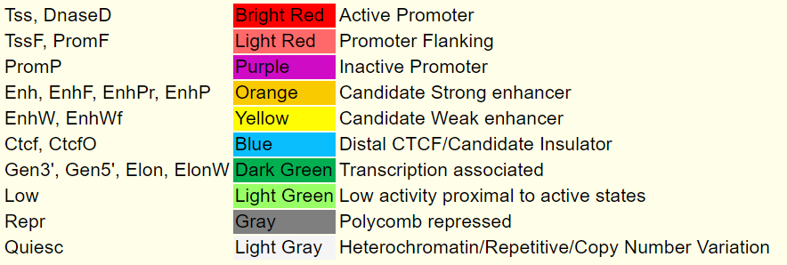
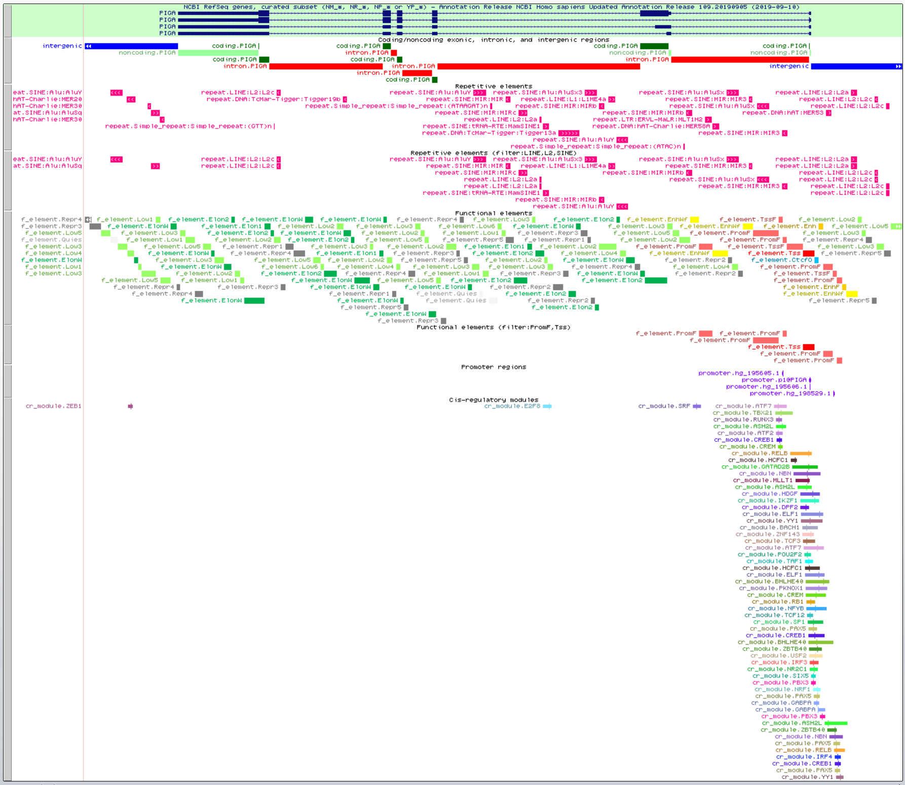

# genomeLabel
## User Guide
Create genomic labels to help identify candidate cis-regulatory regions.

Contents
======
- [What is genomeLabel?](#what-is-genomelabel)
  - [Background](#background)
  - [Data](#data)
  - [Usage](#usage)
- [Installation](#installation)
  - [Dependencies](#dependencies)
  - [Quick Start](#quick-start)
- [Running genomeLabel](#running-genomelabel)
  - [run.pl](#run.pl)
  - [makeHubs.pl](#makehubs.pl)
- [Output of genomeLabel](#output-of-genomelabel)
  - [Example Directory Tree](#example-directory-tree)
  - [Example Data Tracks](#example-data-tracks)
  - [Integration with GIGGLE](#integration-with-giggle)
  - [Example Summary Statistics](#example-summary-statistics)
  - [Memory, Speed, and 'history.txt'](#memory-speed-and-history.txt)

What is genomeLabel?
======
**genomeLabel** is a command line tool for the fully automated generation of genomic label data that can be summarized into statistically relevant information and visualized in a genome browser, tab-separated tables, and plots.
The labels annotate the genome both structurally and functionally, providing insight into the potentially regulatory role of certain regions via colocalization analysis methods.

The genomeLabel tool is implemented in **Perl and Python** and automatically executes commands provided by **bedtools and bedops** to annotate the Genome Reference Consortium Human Build 38 **(hg38)** assembly. Integration with **[GIGGLE](https://www.nature.com/articles/nmeth.4556)** further expands the functionality of genomeLabel to identifying and ranking the significance of genomic loci shared between query features and thousands of genome interval files present in the *giggle_files* directory.

For display by the UCSC Genome Browser, a script 'makeHubs.pl' can be used. Hoewever, assembly hubs need to be hosted on a publicly accessible web server provided by the user.

Background:
------
## Genome Annonation:
Annotating the genome can be broken down into three main steps: (1) identifying portions of the genome that do not code for proteins, (2) identifying elements on the genome, a process called *gene prediction*, and (3) attaching biological information to these elements. This yields two types of annotation:

**1) Structural Annotation -** Identifying elements in the genome (i.e. exons, introns, UTRs, CDSs, etc.)

**2) Functional Annotation -** Attaching biological information to the elements in the genome (e.g. biochemical product, regulatory role, expression, etc.)

Thus, the output of genomeLabel tool combines structural (exon, intron, intergenic, etc.) and putative functional (promoter, enhancer, TF binding site, repetitive sequence, etc.) annotation. 

Data:
------
This program takes in annotation data from genomic databases as input to generate custom label tracks.
  
|INPUT | OUTPUT|
|:--: | :--:|
|[NCBI RefSeq genes, curated subset](https://hgdownload.soe.ucsc.edu/goldenPath/hg38/bigZips/genes/hg38.ncbiRefSeq.gtf.gz)|exon, intron, coding, noncoding, intergenic|
|[UCSC hg38.chrom.sizes](https://hgdownload.soe.ucsc.edu/goldenPath/hg38/bigZips/hg38.chrom.sizes)|intergenic|
|[FANTOM5 TSS (CAGE) peaks](https://fantom.gsc.riken.jp/5/datafiles/reprocessed/hg38_latest/extra/CAGE_peaks/hg38_fair+new_CAGE_peaks_phase1and2.bed.gz)|promoter|
|[RepeatMasker, soft-masked](https://hgdownload.soe.ucsc.edu/goldenPath/hg38/database/rmsk.sql)|repetitive element|
|[Segway genomic "states"](https://noble.gs.washington.edu/proj/encyclopedia/segway_encyclopedia.bed.gz)|functional element|
|[UCSC hg19ToHg38.over.chain.gz](http://hgdownload.soe.ucsc.edu/goldenPath/hg19/liftOver/hg19ToHg38.over.chain.gz)|functional element|
|[ReMap ChIP-seq peaks](http://remap.univ-amu.fr/storage/remap2020/hg38/MACS2/remap2020_crm_macs2_hg38_v1_0.bed.gz)|cis-regulatory module|

Usage:
------
```bash

genomeLabel - A tool to  annotate the genomic features within a given region and work with the contents thereof to produce genome browser tracks and compute summary statistics.

SYNOPSIS
	USAGE: ./run.pl [chr:start-stop] --biotype [BIOTYPE] --path [/PATH/] <filter(s)>
	
	SAMPLE CALLS:
	./run.pl chrX:15200000-15800000 --biotype gm12878 --path /home/bkirsh/
		
	./run.pl chrX:15200000-15800000 --biotype GM12878 --path /home/bkirsh/ --repeat LINE --regulator GATA2
	
	./run.pl chrX:15200000-15800000 --biotype huvec --path /home/bkirsh/ --repeat LINE,L2,SINE --regulator GATA2
	
	The program accepts any of the following six human cell, tissue, or DNA sample used by the ENCODE Consortium:
		GM12878, H1-hESC, K562, HeLa-S3, HepG2, and HUVEC.
	A description of these samples is available at http://genome.ucsc.edu/cgi-bin/hgEncodeVocab?term=GM12878,K562,H1-hESC,HeLa-S3,HepG2,HUVEC.
	This option is case- and delimiter-insensitive, and inputs such as H1HESC, helas3, and HEp-g2 are all valid.
	
	The minimum requirements to run the script are the region, biotype, and path to liftOver.
     
        Additional filter arguments can be passed alongside different commands for added specificity, including "--repeat," "--regulator," and "--felement." 
They must be comma-separated and either enclosed within double-quotes, where whitespace is allowed, or listed subsequently without whitespace in between commas.
     
	ACCEPTABLE:       --regulator "GATA1,CTCF,     SOX2"
                          --regulator GATA1,CTCF,SOX2
        UNACCEPTABLE:     --regulator GATA1, CTCF, SOX2
	
	
      If <filter(s)> is omitted, the default behaviour of the program is to generate a set of "raw files" and the "giggle_files" directory for a given
region and biotype. The "raw files" include genome.bed (coding/noncoding exons, introns, intergenic regions), promoter.bed, repeat.bed, cr-module.bed, f-element.bed, and cat.bed, while the "giggle_files" is a directory tree of their breakdown into different categories and subcategories. These can be useful for customized manipulation 
to extract additional statistics or create more complex tracks via concatenation or application of external tools according to user needs. 

OPTIONS

<chr:start-stop>
	Input region in the format chr:start-end.
<--biotype>
	One of the six human cell types used by the ENCODE Consortium: GM12878, H1-hESC, K562, HeLa-S3, HepG2, HUVEC. A description of
	these cell types is available at http://genome.ucsc.edu/cgi-bin/hgEncodeVocab?term=GM12878,K562,H1-hESC,HeLa-S3,HepG2,HUVEC.
<--path>
	Directory path to liftOver binary file in the format /path/to/utility/ (i.e. enclosed by "/" and excluding the name of the utility itself).
<--regulator>
	A list of one or more of the 960 DNA-binding proteins, including transcription factors (TFs), transcription co-activators (TCFs) and 
	chromatin-remodeling factors (CRFs) used by the ReMap Atlas. Access to ReMap documentation is available at http://remap.univ-amu.fr.
<--repeat>
	A list of one or more of the families, classes, or names of repeats used by RepeatMasker. Access to RepeatMasker documentation is available
	at http://www.repeatmasker.org/webrepeatmaskerhelp.html.
<--felement>
	A list of one or more of the genomic states used by Segway. Access to Segway documentation is available under "Segway Segmentations" at 
	http://genome.ucsc.edu/cgi-bin/hgTrackUi?hgsid=913156841_uydtGuw88KR9Xqpgn3fXaMtXmsVQ&c=chr15&g=hub_4607_genomeSegmentation.
<--help>
	Prints this message and exits successfully.
```

```bash
SYNOPSIS
	USAGE: ./stats_giggle.py -i [input] <option(s)>
	
```

|Label | Definition|
|:---: | :---:|
| Exon | Intragenic stretch of DNA sequence, including non-coding untranslated regions, that can synthesize a functional RNA molecule, including mRNAs and ncRNAs.|
| Intron |  Intragenic stretch of non-coding DNA sequence located between two successive exons.|
| Intergenic |  Stretch of non-coding DNA sequence located between the two successive genes.|
| Coding | Exonic stretch of DNA sequence that can synthesize a functional protein.|
| Noncoding | Exonic stretch of DNA sequence that appears twofold: *(1)* as regulatory untranslated regions of mRNAs or *(2)* as translated regions of ncRNAs.|
| Promoter | Regulatory DNA sequences identified by [FANTOM5](https://fantom.gsc.riken.jp/5/), which reflect CAGE-defined core promoter regions.|
|  Repetitive Element | Regulatory DNA sequences identified by [RepeatMasker](http://www.repeatmasker.org/), which reflect interspersed repeats and low complexity DNA sequences.
| Functional Element | Putative transcriptional and regulatory DNA sequences identified by [Segway](https://www.biorxiv.org/content/10.1101/086025v3.full), which reflect DNA binding and accessibility  across different cell types (e.g. quiescent, enhancer, promoter, bivalent, etc.).Coloured according to Segway schema. |
| Cis-Regulatory Module (CRM) | Putative binding sites for transcriptional regulators identified by [ReMap](https://academic.oup.com/nar/article/48/D1/D180/5608991), which reflect the intersection of overlapping ChIP-seq peaks across different datasets of TRs and biotypes. Coloured according to ReMap schema. |



Installation
======
Dependencies:
------
genomeLabel contains different Perl and Python scripts that require bedtools, bedops, and liftOver. The latter is made available by [UCSC utilities](http://hgdownload.soe.ucsc.edu/admin/exe).

Quick Start:
------
## Clone repository
```bash
git clone https://github.com/bkirsh99/genomeLabel.git
```
## Navigate to the genomeLabel directory
```bash
cd ${genomeLabel_DIR}
```
## Install Perl and required Perl modules
```bash
sudo apt-get install perl
sudo cpan Module::Name
```
## Install Python 2.7 and required Python packages
```bash
sudo apt-get install python-pip 
sudo pip install package
```
## Install bedtools
```bash
git clone https://github.com/arq5x/bedtools2.git
cd bedtools2
make
cd ..
export PATH=$PATH:`which bedtools`
```
## Install bedops
```bash
git clone https://github.com/bedops/bedops.git
cd bedops
make all
make install_all
cp bin/* /usr/local/bin
```
## Locate path to liftOver
  ``` bash
  find / -type f -name "liftOver" 2>/dev/null
  ```
## Install GIGGLE and required GIGGLE dependencies
```bash
git clone https://github.com/ryanlayer/giggle.git
cd giggle
make
export GIGGLE_ROOT=`pwd`
cd lib/htslib
export PATH=$PATH:`pwd`
cd ../../..

wget -O gargs https://github.com/brentp/gargs/releases/download/v0.3.6/gargs_linux
chmod +x gargs
```

Running genomeLabel
======

run.pl
------
This script makes calls and utilizes all other scripts and packages to generate labels, tracks, and summary statistics, depending on the user input.

makeHubs.pl
------
This script produces a directory named after the input region in the format **myHub_chr:start-stop**. It follows UCSC's [Public Hub Guidelines](http://genomewiki.ucsc.edu/index.php/Public_Hub_Guidelines) by generating the following:
```bash
├── myHub_chrX:15200000-15800000 - directory containing track hub files
    ├── hg38 - directory containing hg38 (GRCh38) human assembly data
    |   ├── [...].bb - tracks in this directory
    |   └── trackDb.txt - display properties of tracks in this directory
    ├── genomes.txt - list of genome assemblies included in the hub (i.e. hg38 only)
    └── hub.txt - short description of hub properties
```
To use the output of *makeHubs.pl* in the UCSC Genome Browser, copy the complete hub folder (e.g. myHub_chrX:15200000-15800000) to a publicly accessible web server. Then, go to https://genome.ucsc.edu/index.html, click on My Data -> Track Hubs -> My Hubs, and add the link to your publicly available hub.txt file into the URL window.

Alternatively, you can load individual tracks from './out/chr:start-stop@biotype/tracks/<filter(s)>' as custom tracks on UCSC or IGV.

Output of genomeLabel
======
Example Directory Tree:
------
```bash

```

Example Data Tracks:
------


This is an example of the priority levels behind the labelling of the **raw_genome.bed** track, which is only one of the many tracks generated:
1. **raw_genome.bed** - Coding/noncoding exonic, intronic, and intergenic elements
2. **raw_promoter.bed** - Promoter elements
3. **raw_repeat.bed** - Repetitive elements
4. **filtered_BIOTYPE_f-element.bed** - Putative cell-type-agnostic functional elements
5. **filtered_BIOTYPE_cr-module.bed** - Putative cell-type and transcriptional regulator-agnostic binding sites




These are examples of the difference between raw and filtered tracks. 
The commands used were **./run.pl chrX:15200000-15800000 --biotype gm12878 --path /home/bkirsh/** and **./run.pl chrX:15200000-15800000 --biotype gm12878 --path /home/bkirsh/ --repeat LINE,L2,SINE --regulator GATA2 --felement PromF,Tss.** The second call adds two files to the **chrX:15200000-15800000** directory, namely **filtered_GM12878_LINE_L2_SINE_repeat.bed and filtered_GM12878_PromF_Tss_f-element.bed**. A filtered track was not created for cr-module.bed because there is no data for GATA2 in this biotype, which is verifiable by:
```bash
cat chrX:15200000-15800000/filtered_GM12878_cr-module.bed | grep GATA2
```
Integration with GIGGLE:
------
In its default behaviour, genomeLabel produces the "giggle_files" directory, as exemplified below:
```bash
chrX:15200000-15800000/giggle_files
├── cr-module
│   └── factor
├── exon
│   ├── gene
│   └── transcript
├── f-element
│   └── state
├── intron
│   ├── gene
│   └── transcript
├── promoter
│   └── promoter
├── repeat
│   ├── class
│   ├── family
│   └── name
└── transcript
    ├── gene
    └── transcript
```
Each directory within the "giggle_files" directory tree corresponds to the different levels (e.g. repeat class, family, or name) or preferred labels (e.g. gene name or transcript name) available within the annotated bed files.  
As such, countless permutations of index and query files can be generated and applied by the GIGGLE tool. Detailed instructions and examples of how to run GIGGLE independently are available at https://github.com/ryanlayer/giggle.  
Additional scripts were created to rename the genomic elements in a file before running GIGGLE, resulting in tabular outputs and plots labelled with more meaningful identifiers.  
- rename_bed.py:

   **Sample call:**  
   mkdir split  
   python ./rename_bed.py names.txt split -a all.bed  
   
## Sample independent GIGGLE calls:
```bash
mkdir split_sort
bash $GIGGLE_ROOT/scripts/sort_bed "chrX:15200000-15800000/giggle_files/cr-module/factor/*" split_sort/ > /dev/null
$GIGGLE_ROOT/bin/giggle index -i "split_sort/*" -o split_sort_b -f -s 2> /dev/null
```
### 1) Region search:
```bash
$GIGGLE_ROOT/bin/giggle search -i split_sort_b -r X:15200000-15800000 > cr-module.result

```
### 2) Query file search:
```bash
bgzip chrX:15200000-15800000/giggle_files/transcript/gene/ACE2.bed
$GIGGLE_ROOT/bin/giggle search -i split_sort_b -q chrX:15200000-15800000/giggle_files/transcript/gene/ACE2.bed.gz -s > cr-module_ACE2.result
```

### 3) Query directory search:
```bash
for filename in chrX:15200000-15800000/giggle_files/transcript/gene/*; do bgzip $filename; done
mkdir cr-module_transcript_results
ls chrX:15200000-15800000/giggle_files/transcript/gene | ./gargs -p 10 '$GIGGLE_ROOT/bin/giggle search -i split_sort_b -q chrX:15200000-15800000/giggle_files/transcript/gene/{} -s > cr-module_transcript_results/{}.results'
```

The GIGGLE results consist of a single file or multiple files located within the same directory. In either case, genomeLabel's **stats_giggle.py** script can be used to summmarize and visualize the output when the reults are derived from a GIGGLE call that uses at least one query file with the option "-s."

## Sample stats_giggle.py calls:
### 1) Show top 5 highest scoring index files (e.g. transcription factors) for each query file (e.g. transcript), ranked by combo_score (default):
```bash
./stats_giggle.py -i "cr-module_transcript_results/"
```
### 2) Show top 20 highest scoring index files (e.g. transcription factors) for each query file (e.g. transcript), ranked by number of overlapping intervals:
```bash
./stats_giggle.py -i "cr-module_transcript_results/" --by overlaps -n 20
```
### 3) Show top 5 highest scoring query files (e.g. transcript) for each index file (e.g. transcription factors), ranked by combo_score:
```bash
./stats_giggle.py -i "cr-module_transcript_results/" --by filename
```

Example Summary Statistics:
------
An important application of genomeLabel is that it allows users to visualize interesting overlapping elements on the genome browser, and revert back to using the tool in order to obtain coverage statistics.


Memory, Speed, and 'history.txt'
======
The 'history.txt' file is verified upon every call as a means to avoid requesting redundant data to the UCSC REST API. It consists of an ARRAY created using the Storable package, and stores two sets of HASHES - one made up of previous inputs and another one made up of previous bedFeature objects.
```bash
$VAR1 = [ { biotype => {chr => [ [ start , end ] ] } } , { source1 => [bedFeatures] , ... , sourceN => [bedFeatures] } ]
```
Should you encounter any problems with the generation of files that contain the correct information for your desired coordinates and filters, the issue most likely lies in "history.txt." Please delete the file and run the command again. While this will take longer, it will ensure that the output is correct.
