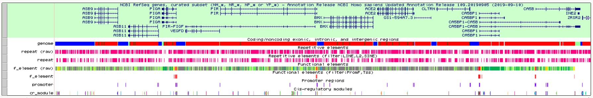
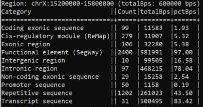
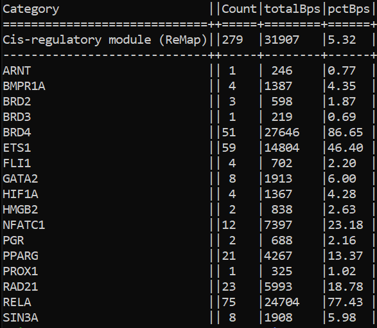
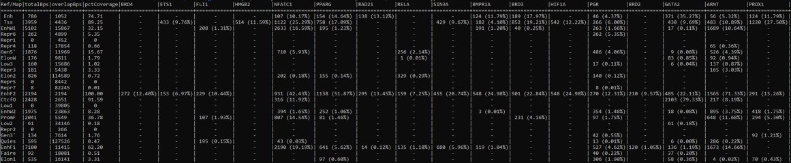

# genomeLabel
## User Guide
Create genomic labels to help identify candidate cis-regulatory regions.

Contents
======
- [What is genomeLabel?](#what-is-genomelabel)
  - [Background](#background)
  - [Data](#data)
  - [Usage](#usage)
- [Installation](#installation)
  - [Dependencies](#dependencies)
  - [Quick Start](#quick-start)
- [Running genomeLabel](#running-genomelabel)
  - [run.pl](#run.pl)
  - [makeHubs.pl](#makehubs.pl)
- [Output of genomeLabel](#output-of-genomelabel)
  - [Example Directory Tree](#example-directory-tree)
  - [Example Data Tracks](#example-data-tracks)
  - [Example Summary Statistics](#example-summary-statistics)
  - [Memory, Speed, and 'history.txt'](#memory-speed-and-history.txt)

What is genomeLabel?
======
**genomeLabel** is a command line tool for the fully automated generation of genomic label data that can be summarized into statistically relevant information and visualized in a genome browser.
The labels annotate the genome both structurally and functionally, providing insight into the potentially regulatory role of certain regions.

The genomeLabel tool is implemented in **perl** and automatically executes commands provided by bedtools and bedops to annotate the Genome Reference Consortium Human Build 38 **(hg38)** assembly.

For display by the UCSC Genome Browser, a script 'makeHubs.pl' can be used. Hoewever, assembly hubs need to be hosted on a publicly accessible web server provided by the user.

Background:
------
## Genome Annonation:
Annotating the genome can be broken down into three main steps: (1) identifying portions of the genome that do not code for proteins, (2) identifying elements on the genome, a process called *gene prediction*, and (3) attaching biological information to these elements. This yields two types of annotation:

**1) Structural Annotation -** Identifying elements in the genome (i.e. exons, introns, UTRs, CDSs, etc.)

**2) Functional Annotation -** Attaching biological information to the elements in the genome (e.g. biochemical product, regulatory role, expression, etc.)

Thus, the output of genomeLabel tool combines structural (exon, intron, intergenic, etc.) and putative functional (promoter, enhancer, TF binding site, repetitive sequence, etc.) annotation. 

Data:
------
This program takes in annotation data from genomic databases as input to generate custom label tracks.
  
|INPUT | OUTPUT|
|:--: | :--:|
|[NCBI RefSeq genes, curated subset](https://hgdownload.soe.ucsc.edu/goldenPath/hg38/bigZips/genes/hg38.ncbiRefSeq.gtf.gz)|exon, intron, coding, noncoding, intergenic|
|[UCSC hg38.chrom.sizes](https://hgdownload.soe.ucsc.edu/goldenPath/hg38/bigZips/hg38.chrom.sizes)|intergenic|
|[FANTOM5 TSS (CAGE) peaks](https://fantom.gsc.riken.jp/5/datafiles/reprocessed/hg38_latest/extra/CAGE_peaks/hg38_fair+new_CAGE_peaks_phase1and2.bed.gz)|promoter|
|[RepeatMasker, soft-masked](https://hgdownload.soe.ucsc.edu/goldenPath/hg38/database/rmsk.sql)|repetitive element|
|[Segway genomic "states"](https://noble.gs.washington.edu/proj/encyclopedia/segway_encyclopedia.bed.gz)|functional element|
|[UCSC hg19ToHg38.over.chain.gz](http://hgdownload.soe.ucsc.edu/goldenPath/hg19/liftOver/hg19ToHg38.over.chain.gz)|functional element|
|[ReMap ChIP-seq peaks](http://remap.univ-amu.fr/storage/remap2020/hg38/MACS2/remap2020_crm_macs2_hg38_v1_0.bed.gz)|cis-regulatory module|

Usage:
------
```bash

genomeLabel - A tool to  annotate the genomic features within a given region and work with the contents thereof to produce genome browser tracks and compute summary statistics.

SYNOPSIS
	USAGE: ./run.pl [chr:start-stop] --biotype [BIOTYPE] --path [/PATH/] <command(s)> <filter(s)>
	
	SAMPLE CALLS:
	./run.pl chrX:15200000-15800000 --biotype gm12878 --path /home/bkirsh/
		(this call is synonymous with ./run.pl chrX:15200000-15800000 --biotype gm12878 --path /home/bkirsh/ --makeLabels)
		
	./run.pl chrX:15200000-15800000 --biotype gm12878 --path /home/bkirsh/ --makeTracks --repeat LINE --regulator GATA2
	
	./run.pl chrX:15200000-15800000 --biotype huvec --path /home/bkirsh/ --makeTracks --repeat LINE,L2,SINE --regulator GATA2
	
	The program accepts any of the following six human cell, tissue, or DNA sample used by the ENCODE Consortium:
		GM12878, H1-hESC, K562, HeLa-S3, HepG2, and HUVEC.
	A description of these samples is available at http://genome.ucsc.edu/cgi-bin/hgEncodeVocab?term=GM12878,K562,H1-hESC,HeLa-S3,HepG2,HUVEC.
	This option is case- and delimiter-insensitive, and inputs such as H1HESC, helas3, and HEp-g2 are all valid.
	
	The minimum requirements to run the script are the region, biotype, and path to liftOver.
	
	The available <command(s)> are: "--makeLabels," "--makeTracks," and "--getStats."
     
        Additional filter arguments can be passed alongside different commands for added specificity. For "--makeLabels" and "--makeTracks," these correspond to "--             repeat," "--regulator," and "--felement." They must be comma-separated and either enclosed within double-quotes, where whitespace is allowed, or listed                   subsequently without whitespace in between commas.
     
	ACCEPTABLE:       --regulator "GATA1,CTCF,     SOX2"
                          --regulator GATA1,CTCF,SOX2
        UNACCEPTABLE:     --regulator GATA1, CTCF, SOX2
	
	For "--getStats", filters (or "options") are followed immediately after the <command> in a comma-separated fashion, as described above. They specify the type and relativity of               statistics to be computed. These include:

      genes                          A list of the genes and their respective transcripts contained in the input region.
      cvgAbs                         The fraction of distinct bases from the input region covered by each major feature (exon, intron, intergenic, promoter, repetitive element, functional element, and cis-regulatory module). 
      cvgRel                         The fraction of distinct bases from the input region covered by each subcategory of major features. Exons are broken down into coding and noncoding, repetitive elements into their classes, families, and names, functional elements into their respective "genomic state", and cis-regulatory module into the corresponding transcription factor. Defaults to summarizing all major elements, but may be used in the form "cvgRel:<ele>," where <ele> corresponds to "ex," "rp," "fe,", or "crm" to output only individual breakdowns. 
      cvg:<ele1>-<ele2>              The fraction of distinct bases from element 1 <el1e> covered by overlapping elements 2 <ele2>
      
        ACCEPTABLE:       --getStats genes,cvgAbs,cvgRel
                          --getStats cvg:fe-crm
     
        If <command(s)> is omitted, the default behaviour of the program is to generate a set of "label files." These can be useful to extract additional statistics or 
	create more complex tracks according to user needs. For simple applications, <command(s)> can be used to output select "track files," track hubs, and summary
	statistics. 

OPTIONS

<chr:start-stop>
	Input region in the format chr:start-end.
<--biotype>
	One of the six human cell types used by the ENCODE Consortium: GM12878, H1-hESC, K562, HeLa-S3, HepG2, HUVEC. A description of
	these cell types is available at http://genome.ucsc.edu/cgi-bin/hgEncodeVocab?term=GM12878,K562,H1-hESC,HeLa-S3,HepG2,HUVEC.
<--path>
	Directory path to liftOver binary file in the format /path/to/utility/ (i.e. enclosed by "/" and excluding the name of the utility itself).
<--regulator>
	A list of one or more of the 960 DNA-binding proteins, including transcription factors (TFs), transcription co-activators (TCFs) and 
	chromatin-remodeling factors (CRFs) used by the ReMap Atlas. Access to ReMap documentation is available at http://remap.univ-amu.fr.
<--repeat>
	A list of one or more of the families, classes, or names of repeats used by RepeatMasker. Access to RepeatMasker documentation is available
	at http://www.repeatmasker.org/webrepeatmaskerhelp.html.
<--felement>
	A list of one or more of the genomic states used by Segway. Access to Segway documentation is available under "Segway Segmentations" at 
	http://genome.ucsc.edu/cgi-bin/hgTrackUi?hgsid=913156841_uydtGuw88KR9Xqpgn3fXaMtXmsVQ&c=chr15&g=hub_4607_genomeSegmentation.
<--makeLabels>
	Default behaviour. Creates unfiltered "labels" that are reported in different files: exon.bed (coding/noncoding exons), intron.bed, transcript.bed,
intergenic.bed, promoter.bed, repeat.bed, cr_module.bed, and f_element.bed. Used to compute statistical data.
<--makeTracks>
	Creates Genome Browser tracks, which are filtered "labels" that are reported in different files: genome.bed (coding/noncoding exons, introns, intergenic
	regions), promoter.bed, repeat.bed, cr_module.bed, and f_element.bed.
<--getStats>
	Generates summary statistics.
<--help>
	Prints this message and exits successfully.
```

|Label | Definition|
|:---: | :---:|
| Exon | Intragenic stretch of DNA sequence, including non-coding untranslated regions, that can synthesize a functional RNA molecule, including mRNAs and ncRNAs.|
| Intron |  Intragenic stretch of non-coding DNA sequence located between two successive exons.|
| Intergenic |  Stretch of non-coding DNA sequence located between the two successive genes.|
| Coding | Exonic stretch of DNA sequence that can synthesize a functional protein.|
| Noncoding | Exonic stretch of DNA sequence that appears twofold: *(1)* as regulatory untranslated regions of mRNAs or *(2)* as translated regions of ncRNAs.|
| Promoter | Regulatory DNA sequences identified by [FANTOM5](https://fantom.gsc.riken.jp/5/), which reflect CAGE-defined core promoter regions.|
|  Repetitive Element | Regulatory DNA sequences identified by [RepeatMasker](http://www.repeatmasker.org/), which reflect interspersed repeats and low complexity DNA sequences.
| Functional Element | Putative transcriptional and regulatory DNA sequences identified by [Segway](https://www.biorxiv.org/content/10.1101/086025v3.full), which reflect DNA binding and accessibility  across different cell types (e.g. quiescent, enhancer, promoter, bivalent, etc.).Coloured according to Segway schema. |
| Cis-Regulatory Module (CRM) | Putative binding sites for transcriptional regulators identified by [ReMap](https://academic.oup.com/nar/article/48/D1/D180/5608991), which reflect the intersection of overlapping ChIP-seq peaks across different datasets of TRs and biotypes. Coloured according to ReMap schema. |


Installation
======
Dependencies:
------
genomeLabel contains different perl scripts that require bedtools, bedops, and liftOver. The latter two are made available by [UCSC utilities](http://hgdownload.soe.ucsc.edu/admin/exe).

Quick Start:
------
## Install perl and required perl modules
```bash
sudo apt-get install perl
sudo cpan Module::Name
```
## Install bedtools
```bash
git clone https://github.com/arq5x/bedtools2.git
cd bedtools2
make clean && make all
```
## Install bedops
```bash
git clone https://github.com/bedops/bedops.git
cd bedops
make all
make install_all
cp bin/* /usr/local/bin
```
## Locate path to liftOver
  ``` bash
  find / -type f -name "liftOver" 2>/dev/null
  ```
## Clone repository
```bash
git clone https://github.com/bkirsh99/genomeLabel.git
```
## Navigate to the genomeLabel directory
```bash
cd ${genomeLabel_DIR}
```

Running genomeLabel
======

run.pl
------
This script makes calls and utilizes all other scripts and packages to generate labels, tracks, and summary statistics, depending on the user input.

makeHubs.pl
------
This script produces a directory named after the input region in the format **myHub_chr:start-stop**. It follows UCSC's [Public Hub Guidelines](http://genomewiki.ucsc.edu/index.php/Public_Hub_Guidelines) by generating the following:
```bash
├── myHub_chrX:15200000-15800000 - directory containing track hub files
    ├── hg38 - directory containing hg38 (GRCh38) human assembly data
    |   ├── [...].bb - tracks in this directory
    |   └── trackDb.txt - display properties of tracks in this directory
    ├── genomes.txt - list of genome assemblies included in the hub (i.e. hg38 only)
    └── hub.txt - short description of hub properties
```
To use the output of *makeHubs.pl* in the UCSC Genome Browser, copy the complete hub folder (e.g. myHub_chrX:15200000-15800000) to a publicly accessible web server. Then, go to https://genome.ucsc.edu/index.html, click on My Data -> Track Hubs -> My Hubs, and add the link to your publicly available hub.txt file into the URL window.

Alternatively, you can load individual tracks from './out/chr:start-stop@biotype/tracks/<filter(s)>' as custom tracks on UCSC or IGV.

Output of genomeLabel
======
Example Directory Tree:
------
```bash
genomeLabel
├── bedFeature.pm
├── fetchFeature.pm
├── run.pl
├── init.pl
├── makeLabels.pl
├── makeTracks.pl
├── getStats.pl
├── chrX:15000000-15800000
│   ├── filtered_K562_CTCF_GATA2_cr-module.bed
│   ├── filtered_K562_Quies_Repr5_f-element.bed
│   ├── filtered_LINE_SINE_repeat.bed
│   ├── raw_genome.bed
│   └── raw_promoter.bed
├── chrX:15500000-15800000
│   ├── filtered_K562_CTCF_GATA2_cr-module.bed
│   ├── filtered_K562_Quies_Repr5_f-element.bed
│   ├── filtered_K562_f-element.bed
│   ├── filtered_LINE_SINE_repeat.bed
│   ├── raw_exon.bed
│   ├── raw_genome.bed
│   └── raw_promoter.bed
├── hg19ToHg38.over.chain.gz
├── hg38.chrom.sizes
├── hg38.ncbiRefSeq.gtf.gz
└── history.txt

Example Data Tracks:
------


This is an example of the priority levels behind the labelling of the **genome.bed** track, which is only one of the many tracks generated:
1. **genome.bed** - Coding/noncoding exonic, intronic, and intergenic elements
2. **promoter.bed** - Promoter elements
3. **repeat.bed** - Repetitive elements
4. **f_element.bed** - Putative cell-type-agnostic functional elements
5. **cr_module.bed** - Putative cell-type and transcriptional regulator-agnostic binding sites




These are examples of the difference between raw and filtered tracks. 
The commands used were **./run.pl chrX:15200000-15800000 --biotype gm12878 --path /home/bkirsh/ --makeTracks** and **./run.pl chrX:15200000-15800000 --biotype gm12878 --path /home/bkirsh/ --makeTracks --repeat LINE,L2,SINE --regulator GATA2 --felement PromF,Tss.**
A filtered track was not created for cr_module.bed because there is no data for GATA2 in this biotype, which is verifiable by:
```bash
cat chrX:15200000-15800000@GM12878/tracks/GM12878/cr_module.bed | grep GATA2
```
Example Summary Statistics:
------
An important application of genomeLabel is that it allows users to visualize interesting overlapping elements on the genome browser, and revert back to using the tool in order to obtain coverage statistics.






Memory, Speed, and 'history.txt'
======
The 'history.txt' file is verified upon every call as a means to avoid requesting redundant data to the UCSC REST API. It consists of an ARRAY created using the Storable package, and stores two sets of HASHES - one made up of previous inputs and another one made up of previous bedFeature objects.
```bash
$VAR1 = [ { biotype => {chr => [ [ start , end ] ] } } , { source1 => [bedFeatures] , ... , sourceN => [bedFeatures] } ]
```

*This tool was inspired by:*
- **davetang/defining_genomic_regions:** https://github.com/davetang/defining_genomic_regions
- **cschlaffner/TrackHubGenerator:**  https://github.com/cschlaffner/TrackHubGenerator
